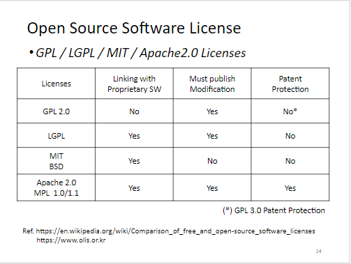
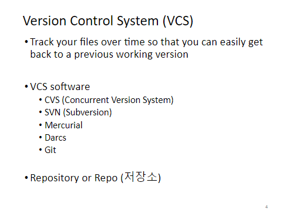
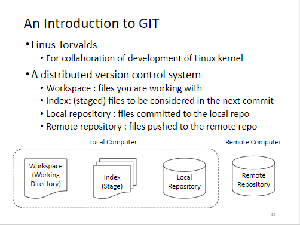
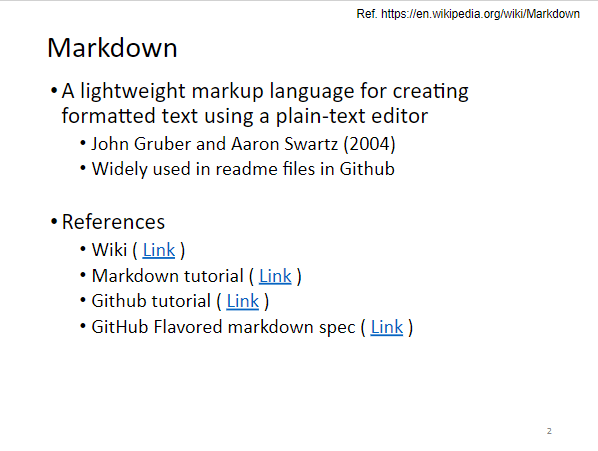

**Week 1-1 강의개요**
=============
> 오픈소스소프트웨어 기본 개념과 도구에 대한 강의

**Week 1-2 오픈소스소프트웨어 개요**
=============
* [오픈소스소프트웨어란?](https://ko.wikipedia.org/wiki/%EC%98%A4%ED%94%88_%EC%86%8C%EC%8A%A4_%EC%86%8C%ED%94%84%ED%8A%B8%EC%9B%A8%EC%96%B4)
> 소스 코드를 공개해 누구나 특별한 제한 없이 그 코드를 보고 사용할 수 있는 오픈 소스 라이선스 를 만족하는 소프트웨어
* 오픈소스소프트웨어 라이센스

**Week 2-1 버전관리 개요**
=============
> 버전 관리(version control)란 동일한 소스 코드에 대한 여러 버전을 관리하는 것

**Week 2-2 Git**
=============
* [Git이란?](https://namu.wiki/w/Git)

**Week 2-3 Github, fork, pull request**
=============
* github <[hompage](https://github.com/)>
> git 데이터를 온라인에 저장해 주는 사이트
* fork
> 다른 사람의 Github Repository에서 내가 어떤 부분을 수정하거나 추가 기능을 넣고 싶을 때 해당 repository를 내 Github Repository로 그대로 복제하는 기능
* pull request
> 복사한 다른 사용자의 저장소에서 여러 기능 수정 및 추가를 한 후, 나의 변경 내역을 저장소 소유자 (오리지널 저장소)에 병합요청을 하는 기능

**Week 3 Markdown**
=============
* Markdown 

